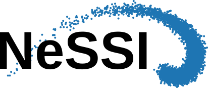

NeSSI (Near-Surface Seismic Imaging) aims to provide python modules for the rapid development of seismic inversion codes based on the particle swarm optimization method.

# Install
First, install git on your computer. For exemple on Ubuntu:

`sudo apt-get install git`

or use the `package manager`.

Then, in a terminal, go to the nessi/nessi folder and type:

`make`

Finally, you have to had the path of the nessi package to `PYTHONPATH`. In your `.bashrc` file, add:

`export PYTHONPATH=$PYTHONPATH:/path/to/the/nessi/package`

# Contributing

NeSSI is developed and tested using python2.7 and python3.5 on GNU/Debian Stretch (stable). 

**Don't suffer from Shiny New Stuff Syndrome** -- [DontBreakDebian](https://wiki.debian.org/DontBreakDebian#Don.27t_suffer_from_Shiny_New_Stuff_Syndrome)