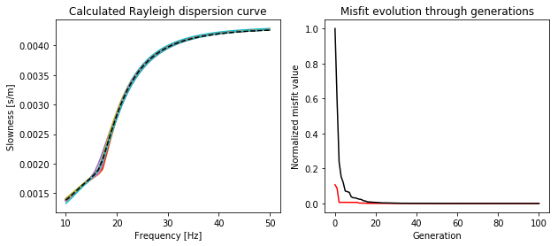

Dispersion curve inversion using GPDC and PSO
=============================================

In this tutorial, the interface with the Geopsy-gpdc modeling engine and
the particle swarm optimization method are combined to build a
dispersion curve inversion script.

This script uses ``numpy`` and ``matplotlib.pyplot`` packages in
addition of ``nessi``.

.. code:: ipython3

    # Import numpy and matplotlib
    import numpy as np
    import matplotlib.pyplot as plt

    # Import the Geopsy-gpdc interface and use aliase for convenience
    from nessi.modeling.interfaces import dispersion_curve_init as gpdc_init
    from nessi.modeling.interfaces import dispersion_curve_rayleigh as gpdc_rayleigh

    # Import Swarm class from NeSSI
    from nessi.globopt import Swarm

The observed dispersion curve
-----------------------------

The observed dispersion curve is generated using the gpdc interface.

.. code:: ipython3

    # Define the model
    nLayers = 4
    h = np.zeros(nLayers, dtype=np.float64)
    vp = np.zeros(nLayers, dtype=np.float64)
    vs = np.zeros(nLayers, dtype=np.float64)
    rho = np.zeros(nLayers, dtype=np.float64)

    # Thickness
    h[0] = 5.0; h[1] = 5.0; h[2] = 5.0

    # S-wave and P-wave velocities
    vs[0] = 250.0; vs[1] = 500.0; vs[2]=750.; vs[3]= 1000.
    vp[:] = 2.*vs[:]

    # Density
    rho[:] = 2000.

    # Frequency sample
    nSamples = 51
    omega = np.linspace(10., 50., 51)
    omega *= 2.*np.pi

    # Mode and output type
    nModes = 1
    group = 0

    # Initialize output array
    slowness = np.zeros((nSamples*nModes), dtype=np.float64)

    # Initialize Geopsy-gpdc
    gpdc_init(0)

    # Calculate theoretical Rayleigh dispersion curve
    gpdc_rayleigh(nLayers, h, vp, vs, rho, nSamples, omega, nModes, slowness, group)

    # Plot observed dispersion curve
    fig = plt.figure(figsize=(10,4))
    plt.subplot(121)
    plt.xlabel(r'Frequency [Hz]')
    plt.ylabel(r'Slowness [s/m]')
    plt.title(r'Observed Rayleigh dispersion curve')
    plt.plot(omega/(2.*np.pi), slowness)
    plt.show();

.. image:: images/dispersion_curve_inversion_01.png

Particle Swarm Optimization
---------------------------

.. code:: ipython3

    # Initialize the swarm class
    swarm = Swarm()

    # PSO parameters
    ngen = 100
    nindv = 20
    fit = np.zeros((ngen+1, 2), dtype=np.float32)

    # Get the search-space from file
    # Here, only thickness and S-wave velocities are searched
    swarm.init_pspace('data/gpdc_pso_pspace.ascii')

    # Initialize particles
    swarm.init_particles(nindv)

.. code:: ipython3

    # First evaluation
    hcalc = np.zeros(nLayers, dtype=np.float64)
    vpcalc = np.zeros(nLayers, dtype=np.float64)
    vscalc = np.zeros(nLayers, dtype=np.float64)
    slowcalc = np.zeros((nSamples*nModes), dtype=np.float64)
    for indv in range(0, nindv):
        # From particle to model parameters
        hcalc[:] = swarm.current[indv, :, 0]
        vscalc[:] = swarm.current[indv, :, 1]
        vpcalc[:] = 2.*vs[:]
        # Calculate the corresponding dispersion curve
        slowcalc[:] = 0.
        gpdc_rayleigh(nLayers, hcalc, vpcalc, vscalc, rho, nSamples, omega, nModes, slowcalc, group)
        # Calculate the misfit
        L2 = 0.
        for iw in range(0, len(slowcalc)):
            L2 += (slowness[iw]-slowcalc[iw])**2
        # Store the misfit value and the history of each particle
        swarm.misfit[indv] = L2
        swarm.history[indv, :, :] = swarm.current[indv, :, :]

    # Get the minimum and the mean misfits of the swarm
    fit[0, 0] = np.amin(swarm.misfit)
    fit[0, 1] = np.mean(swarm.misfit)

.. code:: ipython3

    # Loop over generations
    for igen in range(0, ngen):

        # Update the particles using the constriction factor
        # and the toroidal topology
        swarm.update(control=1, topology='toroidal', ndim=4)

        # Evaluation
        for indv in range(0, nindv):

            # From particle to model parameters
            hcalc[:] = swarm.current[indv, :, 0]
            vscalc[:] = swarm.current[indv, :, 1]
            vpcalc[:] = 2.*vs[:]

            # Calculate the corresponding dispersion curve
            slowcalc[:] = 0.
            gpdc_rayleigh(nLayers, hcalc, vpcalc, vscalc, rho, nSamples, omega, nModes, slowcalc, group)

            # Calculate the misfit
            L2 = 0.
            for iw in range(0, len(slowcalc)):
                L2 += (slowness[iw]-slowcalc[iw])**2

            # If misfit is lower, store the misfit value of each particle
            # and particle history
            if L2 < swarm.misfit[indv]:
                swarm.misfit[indv] = L2
                swarm.history[indv, :, :] = swarm.current[indv, :, :]

        # Get the minimum and the mean misfits of the swarm
        fit[igen, 0] = np.amin(swarm.misfit)
        fit[igen, 1] = np.mean(swarm.misfit)

.. code:: ipython3

    # Plot the best dispersion curves from particles history
    fig1 = plt.figure(figsize=(10,4))
    plt.subplot(121)
    plt.xlabel(r'Frequency [Hz]')
    plt.ylabel(r'Slowness [s/m]')
    plt.title(r'Calculated Rayleigh dispersion curve')
    for indv in range(0, nindv):
        # From particle history to model parameters
        hcalc[:] = swarm.current[indv, :, 0]
        vscalc[:] = swarm.current[indv, :, 1]
        vpcalc[:] = 2.*vs[:]

        # Calculate the corresponding dispersion curve
        slowcalc[:] = 0.
        gpdc_rayleigh(nLayers, hcalc, vpcalc, vscalc, rho, nSamples, omega, nModes, slowcalc, group)
        plt.plot(omega/(2.*np.pi), slowcalc)

    # Plot the observed dispersion curve
    plt.plot(omega/(2.*np.pi), slowness, linestyle='--', color='black')

    plt.subplot(122)
    plt.xlabel(r'Generation')
    plt.ylabel(r'Normalized misfit value')
    plt.title(r'Misfit evolution through generations')
    plt.plot(fit[:,0]/np.amax(fit), color='red')
    plt.plot(fit[:,1]/np.amax(fit), color='black')
    plt.show();

.. code:: ipython3

    # Get the best particle of the swarm
    ibest = np.argmin(swarm.misfit)
    print(swarm.history[ibest, :, :])

.. parsed-literal::

    [[   4.9232965  249.41708  ]
     [   4.603553   477.5197   ]
     [   6.5383964  750.96954  ]
     [   0.        1009.3545   ]]
