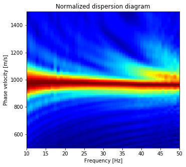

 MASW from SU data
==================

Contrary to other ``SUdata()`` methods, the masw method does not return
a SU file (but it is in the TODO list).

From SU data to MASW dispersion diagram
---------------------------------------

.. code:: ipython3

    #Import numpy and matplotlib
    import numpy as np
    import matplotlib.pyplot as plt

    # Import the SUdata class from nessi.io module
    from nessi.io import SUdata

    # Declare
    dobs = SUdata()

    # Read the SU file
    dobs.read('data/musc_F50_01.su')

.. code:: ipython3

    # Windowing SU data in time
    dobsw = dobs.wind(tmin=0., tmax=0.25)

.. code:: ipython3

    # MASW process -- please wait
    # masw(vmin, vmax, dv, fmin, fmax)
    disp, vel, freq = dobsw.masw(500., 1500., 10., 50., 250.)

.. code:: ipython3

    fig = plt.figure(figsize=(12,5))
    plt.subplot(121)
    dobsw.image(clip=0.05, label2='trace number', label1='time [s]', title='Windowed data', legend=1)
    plt.subplot(122)
    plt.xlabel(r'Frequency [Hz]')
    plt.ylabel(r'Phase velocity [m/s]')
    plt.title(r'Dispersion diagram')
    plt.imshow(disp, aspect='auto', extent=[10., 50., vel[0], vel[-1]], cmap='jet', origin='bottom-left')
    plt.show()

.. image:: images/masw_SU_data_01.png

Normalize the dispersion diagram
--------------------------------

The resulting dispersion diagram is store in a numpy array and can be
easily modified.

.. code:: ipython3

    # Normalize per frequency
    dispn = np.zeros(np.shape(disp), dtype=np.float32)
    for iw in range(0, len(disp[0])):
        dispn[:, iw] = disp[:, iw]/np.amax(np.abs(disp[:, iw]))

.. code:: ipython3

    fig1 = plt.figure(figsize=(12,5))
    plt.subplot(121)
    plt.xlabel(r'Frequency [Hz]')
    plt.ylabel(r'Phase velocity [m/s]')
    plt.title(r'Normalized dispersion diagram')
    plt.imshow(dispn, aspect='auto', extent=[10., 50., vel[0], vel[-1]], cmap='jet', origin='bottom-left')
    plt.show()

