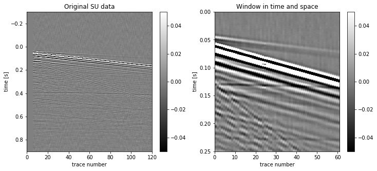

Windowing SU data
=================

The ``wind`` method of the ``SUdata()`` class takes arguments which
allow to wind both in time and space and to modify automatically the
header metadata.

Windowing in time
-----------------

.. code:: ipython3

    # Import matplotlib
    import matplotlib.pyplot as plt

    # Import the SUdata class from nessi.io module
    from nessi.io import SUdata

    # Declare
    dobs = SUdata()

    # Read the SU file
    dobs.read('data/musc_F50_01.su')

    # Windowing in time between t=0s and t=0.25s
    # The window method takes into account the 'delrt' SU header keyword
    dobswt = dobs.wind(tmin=0., tmax=0.25)

    # Show some SU header keywords
    print('ns: ', dobs.header[0]['ns'], ' ', dobswt.header[0]['ns'], '\n')
    print('dt: ', dobs.header[0]['dt']/1000000., ' ', dobswt.header[0]['dt']/1000000., '\n')
    print('delrt: ', dobs.header[0]['delrt']/1000., ' ', dobswt.header[0]['delrt']/1000., '\n')

.. parsed-literal::

    ns:  12000   2502

    dt:  0.0001   0.0001

    delrt:  -0.3   0.0

.. code:: ipython3

    # Plot original and windowed data
    fig = plt.figure(figsize=(12,5))
    plt.subplot(121)
    dobs.image(clip=0.05, label2='trace number', label1='time [s]', title='Original SU data', legend=1)
    plt.subplot(122)
    dobswt.image(clip=0.05, label2='trace number', label1='time [s]', title='Window in time', legend=1)
    plt.show()

.. image:: images/windowing_SU_data_01.png

Window in space
---------------

Using the same function with other arguments, it is possible to apply a
window in space to the SU data.

.. code:: ipython3

    # Windowing in space between trace 20 and trace 80
    dobsws = dobs.wind(key='tracl', min=20, max=80)

    # Show some SU header keywords
    print('ntrac ', len(dobs.header), ' ', len(dobsws.header), '\n')
    print('ns: ', dobs.header[0]['ns'], ' ', dobsws.header[0]['ns'], '\n')
    print('dt: ', dobs.header[0]['dt']/1000000., ' ', dobsws.header[0]['dt']/1000000., '\n')
    print('delrt: ', dobs.header[0]['delrt']/1000., ' ', dobsws.header[0]['delrt']/1000., '\n')

.. parsed-literal::

    ntrac  120   61

    ns:  12000   12000

    dt:  0.0001   0.0001

    delrt:  -0.3   -0.3

.. code:: ipython3

    # Plot original and windowed data
    fig2 = plt.figure(figsize=(12,5))
    plt.subplot(121)
    dobs.image(clip=0.05, label2='trace number', label1='time [s]', title='Original SU data', legend=1)
    plt.subplot(122)
    dobsws.image(clip=0.05, label2='trace number', label1='time [s]', title='Window in space', legend=1)
    plt.show()

.. image:: images/windowing_SU_data_02.png

Windowing in time and space
---------------------------

The windowing method allows to window in time and space at the same
time.

.. code:: ipython3

    # Windowing in space between trace 20 and trace 80
    dobswts = dobs.wind(tmin=0., tmax=0.25, key='tracl', min=20, max=80)

    # Plot original and windowed data
    fig2 = plt.figure(figsize=(12,5))
    plt.subplot(121)
    dobs.image(clip=0.05, label2='trace number', label1='time [s]', title='Original SU data', legend=1)
    plt.subplot(122)
    dobswts.image(clip=0.05, label2='trace number', label1='time [s]', title='Window in time and space', legend=1)
    plt.show()

