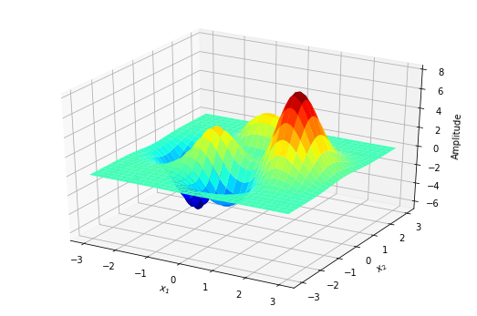

# Particle Swarm Optimization: basics

The Particle Swarm Optimization (PSO) is a meta-heuristic population based method which aims to mimic the behavior of a birds flock.
PSO was first proposed by Eberhart and Kennedy (1995) and Shi and Eberhart (1998).

## Update formulas

## A simple example


```python
# Import matplotlib and numpy modules
import numpy as np
import matplotlib.pyplot as plt
from mpl_toolkits.mplot3d import Axes3D

# Import the Swarm class from NeSSI
from nessi.pso import Swarm
```

The Peaks function in Equation 6 is a function of two
variables,  obtained  by  translating  and  scaling  Gaussian
distributions.  It  has  multiple  peaks  which  are  located
at  (0,1.58),  (0.46,0.63),  and  (1.28,0)  with  different  peak
function values (Aljarah & Ludwig, 2013). The function has the following definition: 

$$
F(X, Y) = 3(1-X)^{2}e^{-[X^{2}+(Y+1)^{2}]}+10\left(\frac{X}{5}-X^{3}-Y^{5}\right)e^{-[X^{2}+Y^{2}]}-\frac{1}{3}e^{-[(X+1)^{2}+Y^{2}]}
$$


```python
def peaksF(x1min, x1max, dx1, x2min, x2max, dx2):
    """
    Return an array containing the 2D Rastrigin function.
    """

    # >> Determine the number of samples
    n1 = int((x1max-x1min)/dx1)+1
    n2 = int((x2max-x2min)/dx2)+1

    # >> Declare array
    f = np.zeros((n1, n2), dtype=np.float32)

    # >> Fill the array
    for i2 in range(0, n2):
        x2 = x2min+float(i2)*dx2
        for i1 in range(0, n1):
            x1 = x1min+float(i1)*dx1
            f[i1, i2] = 3.*(1.-x1)*(1.-x1)\
                        *np.exp(-1.*x1*x1-(x2+1.)*(x2+1.))\
                        -10.*(x1/5.-x1*x1*x1-x2*x2*x2*x2*x2)\
                        *np.exp(-1.*x1*x1-x2*x2)\
                        -1./3.*np.exp(-1.*(x1+1)*(x1+1)-x2*x2)

    return f
```


```python
# The peak function
F = peaksF(-3.0, 3.0, 0.1, -3.0, 3.0, 0.1)

# Initialize 3D plot

fig = plt.figure(figsize=(9,6))
ax = fig.gca(projection='3d')
ax.set_xlabel(r'$x_{1}$')
ax.set_ylabel(r'$x_{2}$')
ax.set_zlabel(r'Amplitude')
X, Y = np.meshgrid(np.linspace(-3, 3, 61), np.linspace(-3, 3, 61))
surf = ax.plot_surface(X, Y, F, vmin=-6.0, vmax=8.0, cmap='jet')
```





## References

Aljarah, I. & Ludwig, S. (2013). A MapReduce based Glowworm Swarm Optimization Approach for Multimodal Functions. 10.1109/SIS.2013.6615155. 

Eberhart, R. C., & Kennedy, J. (1995). Particle swarm optimization. In *IEEE International Conference on Neural Networks, Perth, Australia.*

Shi, Y., & Eberhart, R. (1998, May). A modified particle swarm optimizer. In *Evolutionary Computation Proceedings, 1998. IEEE World Congress on Computational Intelligence., The 1998 IEEE International Conference on (pp. 69-73). IEEE.*
