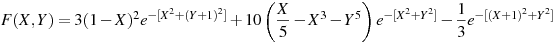
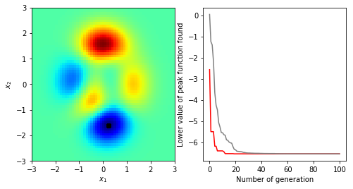

# Particle Swarm Optimization: basics

The Particle Swarm Optimization (PSO) is a meta-heuristic population based method which aims to mimic the behavior of a birds flock.
PSO was first proposed by Eberhart and Kennedy (1995) and Shi and Eberhart (1998).

## Update formulas

## A simple example


```python
# Import matplotlib and numpy modules
import numpy as np
import matplotlib.pyplot as plt
from mpl_toolkits.mplot3d import Axes3D

# Import the Swarm class from NeSSI
from nessi.pso import Swarm
```

### 1-The peak function

The Peaks function in Equation 6 is a function of two
variables,  obtained  by  translating  and  scaling  Gaussian
distributions.  It  has  multiple  peaks  which  are  located
at  (0,1.58),  (0.46,0.63),  and  (1.28,0)  with  different  peak
function values (Aljarah & Ludwig, 2013). The function has the following definition:




```python
def peaksF(X, Y):
    F = 3.*(1.-X)*(1.-X)\
                *np.exp(-1.*X**2-(Y+1.)**2)\
                -10.*(X/5.-X**3-Y**5)\
                *np.exp(-1.*X**2-Y**2)\
                -1./3.*np.exp(-1.*(X+1)**2-Y**2)

    return F
```


```python
# Initialize 3D plot
fig = plt.figure(figsize=(9,6))
ax = fig.gca(projection='3d')
ax.set_xlabel(r'$x_{1}$')
ax.set_ylabel(r'$x_{2}$')
ax.set_zlabel(r'Amplitude')

# Calculate peak function
X, Y = np.meshgrid(np.linspace(-3, 3, 61), np.linspace(-3, 3, 61))
F = peaksF(X, Y)

# Plot
ax.plot_surface(X, Y, F, vmin=-6.0, vmax=8.0, cmap='jet');
```


### 2-Define the search-space

The search-space is delimited by the minimum and maximum values of each parameter (x1 and x2 in this case). An increment value (dx) is added to control the maximum displacement of the swarm's particles.

| x1 min | x1 max | dx1 | x2 min | x2 max | dx2 |
| ------ | ------ | --- | ------ | ------ | --- |
| -3.0   | 3.0    | 0.3 | -3.0   | 3.0    | 0.3 |

### 3-Process


```python
# Initialize the swarm object
swarm = Swarm()

# PSO parameters
fmod = 'pspace_peaks.ascii'
ngen = 100
nindv = 20
fit = np.zeros((ngen+1, 2), dtype=np.float32)

# Get the search-space
swarm.init_pspace(fmod)

# Initialize particles
swarm.init_particles(nindv)
```


```python
# First evaluation
swarm.misfit[:] = peaksF(swarm.current[:, 0, 0], swarm.current[:, 0, 1])
fit[0, 0] = np.amin(swarm.misfit)
fit[0, 1] = np.mean(swarm.misfit)
```


```python
# Loop over generations
for igen in range(0, ngen):
    # Update
    swarm.update(control=1)
    # Evaluation
    for indv in range(0, nindv):
        vfit = peaksF(swarm.current[indv, 0, 0], swarm.current[indv, 0, 1])
        if vfit < swarm.misfit[indv]:
            swarm.history[indv, :, :] = swarm.current[indv, :, :]
            swarm.misfit[indv] = vfit
    # Store the misfit values
    fit[igen+1, 0] = np.amin(swarm.misfit)
    fit[igen+1, 1] = np.mean(swarm.misfit)
```


```python
fig = plt.figure(figsize=(8, 4))
ax1 = fig.add_subplot(1, 2, 1)
ax1.set_xlim(-3.0, 3.0)
ax1.set_ylim(-3.0, 3.0)
ax1.set_xlabel(r'$x_{1}$')
ax1.set_ylabel(r'$x_{2}$')
ax1.imshow(F, aspect='auto', cmap='jet', extent=[-3.0, 3.0, -3.0, 3.0], origin='upper-left')
ax1.scatter(swarm.history[:, 0, 0], swarm.history[:, 0, 1], color='black')
ax2 = fig.add_subplot(1, 2, 2)
ax2.set_xlabel('Number of generation')
ax2.set_ylabel('Lower value of peak function found')
ax2.plot(fit[:, 0], color='red')
ax2.plot(fit[:, 1], color='gray');
```





## References

Aljarah, I. & Ludwig, S. (2013). A MapReduce based Glowworm Swarm Optimization Approach for Multimodal Functions. 10.1109/SIS.2013.6615155. 

Eberhart, R. C., & Kennedy, J. (1995). Particle swarm optimization. In *IEEE International Conference on Neural Networks, Perth, Australia.*

Shi, Y., & Eberhart, R. (1998, May). A modified particle swarm optimizer. In *Evolutionary Computation Proceedings, 1998. IEEE World Congress on Computational Intelligence., The 1998 IEEE International Conference on (pp. 69-73). IEEE.*
